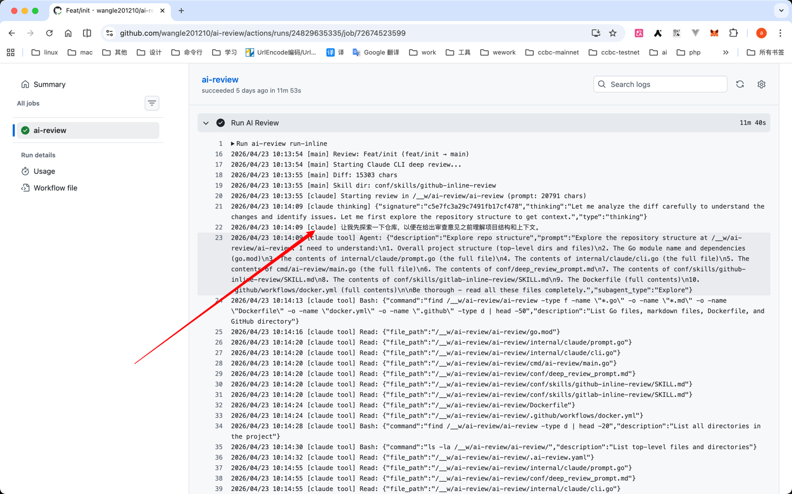
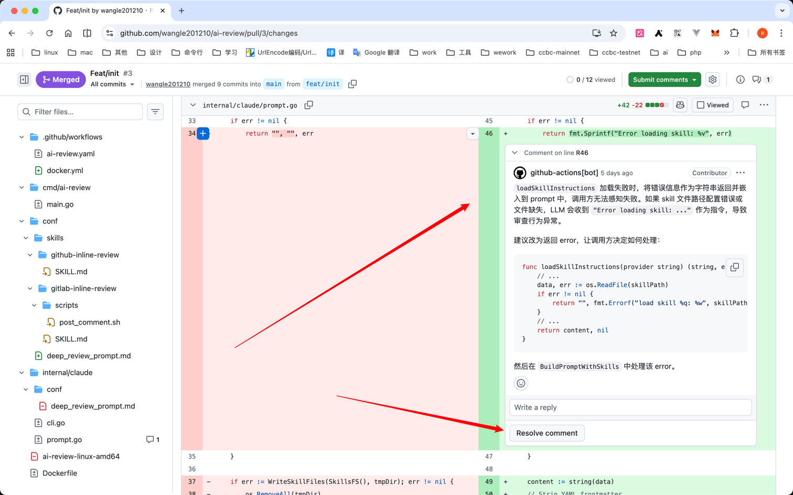

# AI-Review

AI 驱动的自动化代码审查工具，可嵌入 CI/CD 流水线，自动对 **GitHub Pull Request** 和 **GitLab Merge Request** 进行代码审查。

项目也可以把本机 Codex CLI 暴露为受保护的 HTTP 接口，支持通过
`session_id` 延续历史会话，并通过 Lark 群机器人触发告警分析、修复和 MR 流程。

## 效果
使用claude cli进行审查


使用claude cli给出代码审查建议


## CI/CD 集成

### GitHub Actions

在仓库中添加 `.github/workflows/ai-review.yaml`：

```yaml
name: AI Code Review

on:
  pull_request:
    types: [opened, synchronize]

permissions:
  contents: read
  pull-requests: write

jobs:
  ai-review:
    runs-on: ubuntu-latest
    if: ${{ !contains(github.event.pull_request.title, '[skip-review]') }}
    container:
      image: iwangle/ai-review:latest
      options: --user root
    steps:
      - name: Checkout
        uses: actions/checkout@v4
        with:
          fetch-depth: 0

      - name: Run AI Review
        env:
          ANTHROPIC_API_KEY: ${{ secrets.ANTHROPIC_API_KEY }}
          LLM__API_TOKEN: ${{ secrets.ANTHROPIC_API_KEY }}
          LLM__MODEL: claude-sonnet-4-20250514
          LLM__API_URL: https://api.anthropic.com
          VCS__PROVIDER: GITHUB
          VCS__PIPELINE__OWNER: ${{ github.repository_owner }}
          VCS__PIPELINE__REPO: ${{ github.event.repository.name }}
          VCS__PIPELINE__PULL_NUMBER: ${{ github.event.pull_request.number }}
          VCS__HTTP_CLIENT__API_URL: https://api.github.com
          VCS__HTTP_CLIENT__API_TOKEN: ${{ secrets.GITHUB_TOKEN }}
          AGENT__MAX_ITERATIONS: 25
        run: ai-review run-inline
```

> **注意**：`LLM__MODEL`、`LLM__API_URL`、`LLM__API_TOKEN` 可替换为兼容 Anthropic 协议的其他模型服务。

### GitLab CI

在 `.gitlab-ci.yml` 中添加：

```yaml
ai-review:
  when: manual
  stage: review
  image: iwangle/ai-review:latest
  rules:
    - if: '$CI_MERGE_REQUEST_IID'
  script:
    - ai-review run-inline
  variables:
    GIT_DEPTH: 0
    LLM__MODEL: "claude-sonnet-4-20250514"
    LLM__MAX_TOKENS: "4096"
    LLM__API_URL: "https://api.anthropic.com"
    LLM__API_TOKEN: "$ANTHROPIC_API_KEY"
    VCS__PROVIDER: "GITLAB"
    VCS__PIPELINE__PROJECT_ID: "$CI_PROJECT_ID"
    VCS__PIPELINE__MERGE_REQUEST_ID: "$CI_MERGE_REQUEST_IID"
    VCS__HTTP_CLIENT__API_URL: "$CI_SERVER_URL"
    VCS__HTTP_CLIENT__API_TOKEN: "$CI_JOB_TOKEN"
  allow_failure: true
```

> 完整示例见 [`docs/ci/gitlab.yaml`](docs/ci/gitlab.yaml)。

## 快速开始

### 前置条件

- [Anthropic API Key](https://console.anthropic.com/) 也可以是glm等
- GitHub Personal Access Token 或 GitLab CI Job Token

### 使用 Docker（推荐）

```bash
docker pull iwangle/ai-review:latest
```

**GitHub PR 审查：**

```bash
docker run --rm \
  -e ANTHROPIC_API_KEY="sk-ant-..." \
  -e VCS__PROVIDER=GITHUB \
  -e VCS__PIPELINE__OWNER=myorg \
  -e VCS__PIPELINE__REPO=myrepo \
  -e VCS__PIPELINE__PULL_NUMBER=7 \
  -e VCS__HTTP_CLIENT__API_TOKEN="ghp_..." \
  iwangle/ai-review:latest run-inline
```

**GitLab MR 审查：**

```bash
docker run --rm \
  -e ANTHROPIC_API_KEY="sk-ant-..." \
  -e VCS__PROVIDER=GITLAB \
  -e VCS__PIPELINE__PROJECT_ID=123 \
  -e VCS__PIPELINE__MERGE_REQUEST_ID=42 \
  -e VCS__HTTP_CLIENT__API_URL=https://gitlab.com \
  -e VCS__HTTP_CLIENT__API_TOKEN="glpat-..." \
  iwangle/ai-review:latest run-inline
```

### 从源码构建

```bash
# 前置条件：Go 1.24+，Claude Code CLI
npm i -g @anthropic-ai/claude-code

# 构建
go build -o ai-review ./cmd/ai-review

# 使用配置文件运行
./ai-review run-inline
```

## 工作原理

AI-Review 采用双层审查架构：

1. **深度逐行审查 (Inline Review)** — 调用 [Claude Code CLI](https://docs.anthropic.com/en/docs/claude-code) 作为自主 Agent，探索仓库上下文、分析 diff，并通过 GitHub/GitLab API 在具体代码行上发布内联评论和修改建议。
2. **摘要审查 (Summary Review)** — 调用 Anthropic Messages API 生成结构化变更摘要（概述、关键变更、问题、建议），作为整体评论发布到 MR/PR。

## 命令

| 命令 | 说明 |
|---|---|
| `ai-review run` | 完整审查：深度逐行审查 + 摘要审查 |
| `ai-review run-inline` | 仅深度逐行审查 |
| `ai-review run-summary` | 仅摘要审查 |
| `ai-review serve-codex` | 启动 Codex HTTP 服务 |
| `ai-review serve-lark-codex` | 启动 Lark 到 Codex HTTP 的群机器人适配器 |

## Codex HTTP 服务

HTTP 服务适用于从另一台电脑发送单轮消息，并在需要上下文时携带之前返回的
`session_id`。服务默认只监听 `127.0.0.1:8787`，推荐通过 SSH 端口转发访问。
`HTTP__AUTH_TOKEN` 为空时不要求鉴权；对外监听时应始终配置 Token。
服务只负责把消息原样交给 Codex CLI；日志查询、源码分析、修复和创建 MR 由
[`nova-incident-remediation`](skills/nova-incident-remediation/SKILL.md) skill 完成。
仓库内同时包含它依赖的
[`kibana-log-query`](skills/kibana-log-query/SKILL.md) 和
[`nova-game-play-code-analysis`](skills/nova-game-play-code-analysis/SKILL.md)，安装方式见
[`docs/codex-http.md`](docs/codex-http.md)。

```bash
export HTTP__AUTH_TOKEN="$(openssl rand -hex 32)"
export CODEX__WORK_DIR=/srv/my-project

ai-review serve-codex
```

新建会话：

```bash
curl http://127.0.0.1:8787/v1/codex \
  -H "Authorization: Bearer $HTTP__AUTH_TOKEN" \
  -H "Content-Type: application/json" \
  -d '{"message":"检查当前项目并指出最重要的问题"}'
```

继续会话时，在请求中增加服务端之前返回的 `session_id`。完整配置、响应格式、
Codex CLI 完整输出的 `journalctl` 查看方式、SSH 隧道和安全说明见
[`docs/codex-http.md`](docs/codex-http.md)。

## Lark Codex 机器人

`serve-lark-codex` 使用 Lark 长连接接收群里的 `@机器人` 回复，把用户消息与被回复
的告警原文发送到本机 Codex HTTP 服务。它用根消息 ID 保存 Codex `session_id`，
因此同一线程中的后续要求会延续上下文。服务只有一个 worker，不会并发启动多个
Codex CLI。

Lark 开发者后台所需事件、权限、环境变量、systemd 配置和群内使用方式见
[`docs/lark-codex-bot.md`](docs/lark-codex-bot.md)。

## 配置

### 配置文件

在项目根目录创建 `.ai-review.yaml`（也支持 `.yml` / `.json`）：

```yaml
llm:
  model: claude-sonnet-4-20250514
  max_tokens: 4096
  temperature: 0.3
  api_url: https://api.anthropic.com
  api_token: ${ANTHROPIC_API_KEY}

vcs:
  provider: GITHUB                # GITHUB 或 GITLAB
  pipeline:
    owner: myorg                  # GitHub
    repo: myrepo                  # GitHub
    pull_number: 1                # GitHub
  http_client:
    api_url: https://api.github.com
    api_token: ${GITHUB_TOKEN}

agent:
  max_iterations: 25              # Claude Code CLI 最大交互轮次

review:
  dry_run: false                  # true 时不发布评论（仅打印）
```

配置文件支持 `${ENV_VAR}` 插值，所有字段均可通过环境变量覆盖。

### 环境变量

使用 `__` 作为层级分隔符覆盖配置：

| 环境变量 | 说明 |
|---|---|
| `ANTHROPIC_API_KEY` | Anthropic API 密钥 |
| `LLM__API_TOKEN` | LLM API 密钥（优先于 `ANTHROPIC_API_KEY`） |
| `LLM__MODEL` | Claude 模型 |
| `LLM__MAX_TOKENS` | 最大输出 token 数 |
| `LLM__API_URL` | API 端点 URL |
| `VCS__PROVIDER` | `GITHUB` 或 `GITLAB` |
| `VCS__PIPELINE__OWNER` | GitHub 仓库所有者 |
| `VCS__PIPELINE__REPO` | GitHub 仓库名 |
| `VCS__PIPELINE__PULL_NUMBER` | GitHub PR 编号 |
| `VCS__PIPELINE__PROJECT_ID` | GitLab 项目 ID |
| `VCS__PIPELINE__MERGE_REQUEST_ID` | GitLab MR IID |
| `VCS__HTTP_CLIENT__API_URL` | VCS API 地址 |
| `VCS__HTTP_CLIENT__API_TOKEN` | VCS 认证 Token |
| `AGENT__MAX_ITERATIONS` | Agent 最大交互轮次 |
| `REVIEW__DRY_RUN` | 试运行模式 |

### 跳过审查

在 PR/MR 标题中添加 `[skip-review]` 即可跳过自动审查。

## 项目结构

```
ai-review/
├── cmd/ai-review/main.go          # CLI 入口
├── conf/
│   ├── deep_review_prompt.md      # 深度审查 Prompt
│   └── skills/
│       ├── github-inline-review/  # GitHub 内联评论技能
│       └── gitlab-inline-review/  # GitLab 内联评论技能
├── deploy/systemd/                # Codex/Lark 服务部署单元
├── docs/ci/gitlab.yaml            # GitLab CI 示例
├── internal/
│   ├── claude/                    # Claude Code CLI 调用封装
│   ├── codex/                     # Codex CLI JSONL 调用封装
│   ├── codexhttp/                 # Codex HTTP API、鉴权和并发控制
│   ├── config/                    # 配置加载（YAML + 环境变量）
│   ├── larkbot/                   # Lark 长连接、队列、会话映射与 Codex HTTP 客户端
│   ├── llm/                       # Anthropic Messages API 客户端
│   ├── prompt/                    # Prompt 模板管理
│   ├── review/                    # 审查流程编排
│   └── vcs/
│       ├── github/                # GitHub API 客户端
│       └── gitlab/                # GitLab API 客户端
├── skills/
│   ├── kibana-log-query/          # Kibana 日志查询和时间线重建
│   ├── nova-game-play-code-analysis/ # Nova 项目准备和源码分析
│   └── nova-incident-remediation/ # 告警定位、修复和 MR 编排
├── Dockerfile                     # 多阶段构建（Go + Node/Claude CLI）
└── .github/workflows/
    ├── ai-review.yaml             # GitHub Actions 审查工作流
    └── docker.yml                 # Docker 镜像构建工作流
```

## 技术栈

| 组件 | 技术 |
|---|---|
| 语言 | Go 1.24 |
| CLI 框架 | [cobra](https://github.com/spf13/cobra) |
| AI（深度审查） | [Claude Code CLI](https://docs.anthropic.com/en/docs/claude-code) |
| Codex HTTP 服务 | Codex CLI 非交互模式 |
| Lark 机器人 | Lark OpenAPI Go SDK 长连接 |
| AI（摘要审查） | [Anthropic Messages API](https://docs.anthropic.com/en/api/messages) |
| 运行时 | Node.js 20 + Claude Code CLI + Codex CLI |
| 容器 | Docker（支持 amd64 / arm64） |

## License

[MIT](LICENSE)
